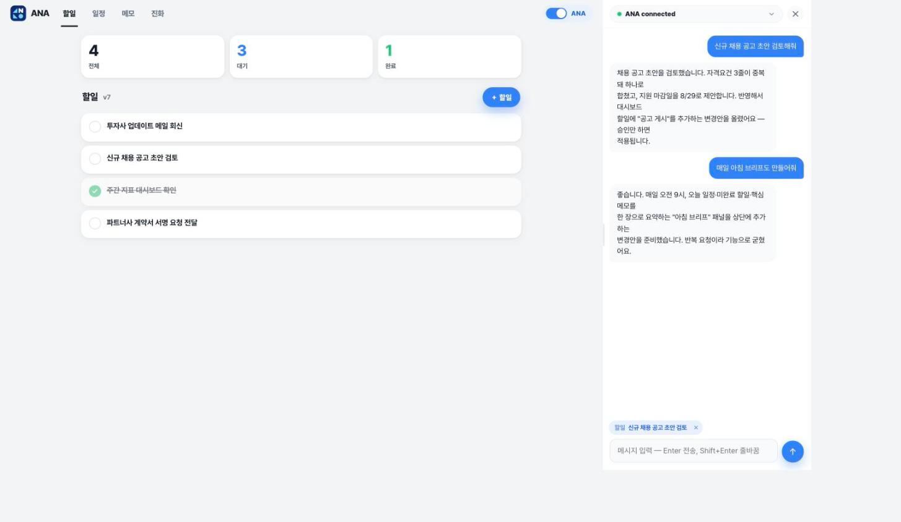
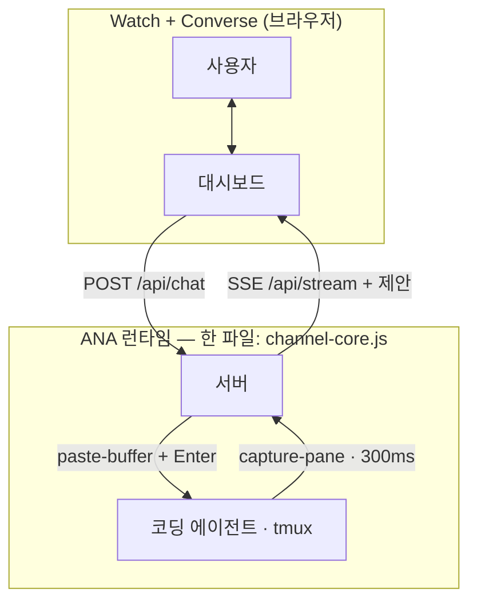

<div align="center">


# ANA — Agent‑Native Agent

### 보면서 대화하는 것만으로 운영하는 앱을 만드세요.

[](https://github.com/tykimos/agent-native-agent/stargazers)
[](LICENSE)
[](https://claude.com/claude-code)
[](channel-core.js)
[](https://github.com/tykimos/agent-native-agent/commits/main)
[](#contributing)

[English](README.md) · **한국어**

<br/>



</div>

---

## 요약(TL;DR)

**ANA는 _Agent‑Native Lifestyle_(ANL)을 위한 _Agent‑Native Agent_입니다.** 실시간 대시보드를 **보면서(watch)**, 런타임 역할을 하는 코딩 에이전트와 **대화하는(converse)** 것만으로 운영하는 셀프‑호스팅 앱입니다. 새로운 동작이 필요하신가요? 한 번 말하기만 하면 됩니다 — ANA가 변경안을 제안하고, 승인 시 적용하며, 런타임에서 앱을 진화시킵니다. PR도, 배포 단계도 없습니다 — 실행 중인 에이전트가 앱을 즉석에서 다시 쓰고 대시보드가 새로고침됩니다.

> 사용 = 제작. 그것이 핵심의 전부입니다.

---

## 어시스턴트가 아니라 에이전트인 이유

어시스턴트는 지시를 기다립니다. 에이전트는 판단하고, 실행하며, 당신의 업무를 둘러싼 도구를 스스로 개선합니다. 오늘날 모든 도구는 여전히 **사용하기**와 **만들기** 사이의 절충을 강요합니다 — ANA는 그 간극을 없앱니다.

|  | SaaS / 앱 | No‑code | 챗봇 | 코딩 에이전트 | **ANA** |
|---|:---:|:---:|:---:|:---:|:---:|
| 즉시 사용 | ✅ | ✅ | ✅ | ❌ | ✅ |
| *무엇이든* 변경 | ❌ | ⚠️ 정해진 범위 내 | ❌ | ✅ | ✅ |
| 실시간 데이터를 봄 | ✅ | ✅ | ⚠️ | ⚠️ | ✅ |
| **사용하면서 바로 변경 — 같은 대화에서** | ❌ | ❌ | ❌ | ⚠️ | ✅ |
| 완전한 소유(셀프‑호스팅) | ❌ | ❌ | ❌ | ✅ | ✅ |

SaaS는 *즉시 쓸 수 있지만 고정*되어 있습니다. 코딩 에이전트는 *무한히 유연하지만 빌드 타임 전용* — 만든 뒤에 씁니다. **ANA는 앱을 사용하는 행위(말하기)를 곧 만드는 행위(동작 변경)와 동일하게 만듭니다.** 에이전트가 런타임에 네이티브로 존재하기 때문입니다.

---

## 세 가지 원칙

1. **Watch + Converse** — 시각적 상태와 대화가 *하나의* 화면 안에 함께 있습니다. 고정된 UI를 클릭하는 대신, 보고 말하는 것으로 운영합니다.
2. **Agent as Runtime** — 에이전트가 당신의 데이터를 읽고, 행동하며, 요청 시 **앱 자체의 코드를 다시 씁니다**. 추론(inference)이 곧 런타임입니다.
3. **Own Your Harness** — 의존성 없이, 셀프‑호스팅으로, 영원히 당신의 것입니다. 당신과 함께 계속 진화합니다.

이 원칙들은 이 하네스로 만든 모든 ANA의 수용 기준이기도 합니다.

---

## 작동 방식



**브리지도 MCP도 없습니다.** 브라우저가 서버로 보내면, 서버가 그 텍스트를 tmux 페인에 곧바로 주입하고, 300ms `capture-pane` 루프가 세션을 append-only 원장으로 되비춰 SSE로 내보냅니다. 리치 응답의 경우 에이전트가 **제안**(전/후 + 승인 카드)을 올리고, 승인하면 서버가 diff를 적용한 뒤 `version`을 올려 모든 기기가 다시 동기화됩니다. **코딩 에이전트가 곧 백엔드입니다** — 말하는 것으로 앱을 키웁니다.

---

## 빠른 시작 — 베이스 실행 (2분)

**사전 요구사항:** Node ≥ 24, tmux, 그리고 코딩 에이전트 CLI(예: [Claude Code](https://claude.com/claude-code)). 런타임(`channel-core.js`)은 의존성이 없고, 베이스 앱은 [NodeRel](https://github.com/tykimos/NodeRel) 하나를 `npm install`로 GitHub에서 받습니다.

### `install` 스킬로 설치·실행 (권장)

**[`install` 스킬](skills/install/SKILL.md)** 하나로 빈 머신에서 대시보드가 뜨는 데까지 갑니다. 먼저 환경을 분석하고, 빠진 것(Node ≥ 24, tmux, git, curl, Claude Code)과 npm 의존성만 설치한 뒤, 에이전트와 서버를 tmux로 띄우고 응답을 확인합니다. 모든 스크립트는 여러 번 실행해도 안전합니다.

```bash
git clone https://github.com/tykimos/agent-native-agent && cd agent-native-agent
bash skills/install/scripts/check-env.sh   # 1) 환경 분석 — 보고만 하고 아무것도 바꾸지 않음
bash skills/install/scripts/install.sh     # 2) 빠진 것만 설치 (brew / apt / dnf / pacman …)
bash skills/install/scripts/run.sh         # 3) tmux "ana"(에이전트) + "ana-server"(서버) → URL 출력
bash skills/install/scripts/run.sh status  #    이후: status | stop | restart
```

| 스크립트 | 역할 |
|---|---|
| `check-env.sh` | macOS / Linux / WSL / Git Bash를 판별하고 node·tmux·git·curl·claude·저장소 위치·포트를 점검. 마지막 줄에 `ANA_ENV … ready=yes\|no` |
| `install.sh` | 빠진 것만 설치(macOS는 Homebrew, Linux/WSL은 시스템 패키지 관리자 + NodeSource)하고 Claude Code CLI 설치, 저장소 밖에서 실행하면 clone까지 |
| `run.sh` | tmux 세션을 띄우거나 재사용, 8809가 사용 중이면 빈 포트를 고르고 응답 확인. `TMUX_SESSION`·`PORT`·`AGENT_CMD`로 변경 가능 |
| `install-wsl.ps1` | **Windows:** tmux는 WSL 안에서만 동작합니다. WSL + Ubuntu를 설치(재부팅 후 다시 실행)한 뒤 WSL 안에서 ANA를 설치·실행. Windows 브라우저에서 `http://localhost:8809`로 접속 |

```powershell
# Windows (PowerShell, 첫 실행만 관리자 권한)
powershell -ExecutionPolicy Bypass -File skills\install\scripts\install-wsl.ps1
```

Claude Code에 스킬이 설치돼 있으면(이 저장소는 플러그인입니다) *"ANA 설치해줘"* 라고만 하면 됩니다. 에이전트가 같은 단계를 수행하고, 최초 1회 Claude 로그인(`tmux attach -t ana` → `Ctrl-b d`로 빠져나오기)이 필요할 때 알려 줍니다.

### 수동 실행

```bash
git clone https://github.com/tykimos/agent-native-agent
cd agent-native-agent

# 1) tmux 안에서 코딩 에이전트를 먼저 띄웁니다
tmux new -s ana          # 세션 안에서 실행:  claude   (또는 아무 에이전트 CLI)

# 2) 다른 터미널에서 ANA 서버를 띄웁니다
node server.js           # → http://localhost:8809
```

**http://localhost:8809**을 열고 우측 하단 채팅을 열어 대화하세요. 우측 상단 **Chip**을 켜면 화면 요소를 클릭해 대화 컨텍스트로 넣을 수 있습니다. 서버 자체는 **별도 실행 스크립트가 필요 없습니다**(`run.sh`는 편의용) — 서버가 연결 시 tmux 페인을 자동 설정(스크롤백 보존)합니다. 런타임 상태는 `.ana/`에 저장됩니다(git 제외).

레퍼런스 대시보드에는 **워크스페이스**, **Chip 모드**(요소를 클릭해 컨텍스트 칩으로 고정, ⟳로 새로 생긴 요소 등록), 크기 조절 가능한 도킹 채팅, **진화 탭**(변경을 요청 → 승인하면 실행 중인 에이전트가 앱을 직접 수정)이 들어 있습니다.

### 메모 · 할일 · 일정을 하나의 그래프로 (NodeRel)

보드에는 **Tasks, Calendar, Notes, Stats, Requests, Evolve** 여섯 탭이 있고, 앞의 세 탭은 [NodeRel](https://github.com/tykimos/NodeRel)로 만든 관계 그래프로 이어집니다. 진실원천은 여전히 `state.json`입니다(항목들 + 명시적 관계 목록 `links[]`). `graph.js`는 서명이 바뀔 때마다 여기서 SQLite 인덱스(`graph.sqlite`, 워크스페이스마다 하나)를 다시 만듭니다. 그래서 UI, 에이전트 diff, 파일 직접 수정 등 어느 경로로 바꿔도 그래프에 반영됩니다.

```
Note ─SPAWNED──────▶ Task | Event     이 할일·일정이 나온 메모             (명시)
Task ─SCHEDULED_AS─▶ Event            그 할일을 하기로 잡은 시간           (명시)
Note|Task|Event ─REFERS_TO─▶ Note|Task|Event   수동 참조                  (명시)
Task ─DUE_ON─▶ Day,  Event ─ON─▶ Day           due / date에서 파생         (자동)
```

화면에서는 메모의 한 줄을 선택하고 **→ Task** / **→ Event**를 누르면 할일·일정이 만들어집니다. 할일의 달력 버튼으로 시간을 잡고, **＋ Link**로 두 항목을 잇습니다. 관계는 칩으로 보이고, 칩을 누르면 그 항목이 있는 탭으로 이동합니다. **Stats → Connections**는 관계 개수를 세고 흐름이 끊긴 곳을 보여 줍니다. 아무것도 나오지 않은 메모, 기한 없는 할일, 시간이 안 잡힌 할일입니다.

| 엔드포인트 | 용도 |
|---|---|
| `GET /api/state` → `graph.links` | 워크스페이스의 모든 관계(NodeRel에서) |
| `POST /api/todo {title, due?, from?}` · `POST /api/event {action:'add', …, from?}` | 만들면서 출처와 연결(`from`이 메모면 `SPAWNED`, 할일이면 `SCHEDULED_AS`) |
| `POST /api/link {action:'add'\|'remove', from, to, type}` | `SPAWNED`·`SCHEDULED_AS`·`REFERS_TO` 추가/삭제(방향 검증) |
| `GET /api/graph/neighbors?id=` · `GET /api/graph/trace?id=&depth=&direction=&types=` | 붙어 있는 관계 / 도달 가능한 전체 |
| `GET /api/graph/schema` | NodeRel의 AI용 스키마 + 이 앱의 관계 의미 — 에이전트에게 건네면 됩니다 |
| `GET /api/stats` → `graph` | 종류·관계별 개수와 `gaps` 세 목록 |

**Requests와 Evolve.** 두 탭은 방향이 반대입니다. **Evolve**는 에이전트가 *앱을 바꾸자고* 제안하는 곳이고, 승인하면 에이전트가 만듭니다. **Requests**는 에이전트가 시스템을 더 잘 운용하려고 *사용자에게* 부탁하는 곳입니다. 필요한 정보, 결정(선택지 버튼), 사용자만 할 수 있는 일, 접근 권한을 요청합니다. 에이전트는 `POST /api/requests {requests:[{kind, title, desc?, options?, ref?}]}`로 등록합니다(`kind` = `info|decision|action|access`, `ref` = 링크로 보일 할일·일정·메모 id). 답을 보내면 채팅으로 에이전트에게 바로 전달되고, *I did it* / *Not now*는 알림으로 전달됩니다(`POST /api/request-act {id, action: answer|done|dismiss|reopen}`).

**화면에 그리기.** Chip 모드에서 ⟳ 옆 펜 버튼을 누르면 보드 위에 캔버스가 깔립니다. UI에 쓰지 않는 빨강·마젠타·파랑으로 짚고 싶은 곳에 동그라미를 치고 *Add to chat*을 누르면, 그림이 합성된 화면 캡처가 첨부됩니다. 칩에는 현재 위치(워크스페이스, 탭, 선택한 날짜나 메모, 스크롤)와 각 표시가 가리키는 항목(`magenta mark on Task "book venue"`)이 함께 들어갑니다. 캡처는 [modern-screenshot](https://github.com/qq15725/modern-screenshot)을 `/vendor/`에서 로컬로 제공해 씁니다.

### 여러 사람과 함께 쓰기 (선택)

ANA에는 **자체 로그인이 없습니다.** 혼자 자체 호스팅할 때는 그게 오히려 요점입니다 — 루프백에 묶어두면 그것으로 끝입니다. 여러 사람이 같은 보드를 봐야 한다면, 인증을 처리하는 앞단(리버스 프록시·SSO 게이트웨이·Zero Trust 터널)을 두고 사용자 식별자를 요청 헤더로 넘기게 하세요.

```bash
ANA_IDENTITY_HEADER=x-forwarded-email \
ANA_LOGOUT_URL=/your-gateway/logout \
node server.js
```

헤더가 잡히면 항목에 작성자가 남고, 자기가 만든 것만 수정·삭제할 수 있으며, 개인별 통계와 활동 기록이 동작합니다. 지정하지 않으면(기본값) 전부 단일 사용자로 동작합니다.

**사람별 코딩 에이전트 세션.** 채팅 상단의 연결 표시(`ANA · <세션>`)를 눌러 tmux 세션을 고릅니다. 세션마다 대화 이력이 따로 있어서 바꾸면 채팅이 그 세션의 대화로 통째로 바뀝니다. 고른 세션은 **사람별로** 기억되어, 다음에 접속하면 각자 자기가 마지막에 쓴 세션이 선택됩니다. 목록에는 세션마다 누가 골랐는지(지금 보고 있으면 ●)가 표시됩니다. 에이전트가 `curl`로 응답을 올릴 때는 `x-ana-target: <세션>` 헤더로 자기 세션을 지정할 수 있습니다.

**에이전트의 질문.** Claude가 AskUserQuestion으로 묻거나 권한 메뉴를 띄우면 채팅에 카드로 렌더됩니다. 질문 탭, 설명이 붙은 선택지 버튼, 다중 선택 체크박스, "Type something"용 직접 입력칸, 제출/취소 버튼이 있고, 서버가 클릭을 알맞은 키 입력으로 바꿔 보냅니다.

> 이 헤더는 그대로 신뢰합니다. 따라서 앞단이 실제로 붙여줄 때만 의미가 있습니다. 서버는 루프백이나 그 프록시 뒤에 두세요. 이 옵션을 켠 채 `0.0.0.0`으로 열면 누구나 헤더를 위조해 남의 이름으로 쓸 수 있습니다.

---

## 기존 서비스에 ANA 붙이기 (아주 간단)

**런타임 전체가 의존성 없는 한 파일 [`channel-core.js`](channel-core.js)** 입니다. 넣고 마운트하기만 하면 됩니다:

```js
const path = require('node:path');
const core = require('./channel-core.js');
const app = core.createChannelServer({
  PORT: 8809, BIND: '127.0.0.1',
  SESSION: process.env.TMUX_SESSION || 'ana',
  SOCKET: process.env.TMUX_SOCKET || '',
  TARGET: core.resolveTarget(__dirname, process.env),
  FEED_FILE: path.join(__dirname, '.ana', 'transcript.jsonl'),
  SERVABLE: new Set(['index.html']),   // 당신의 대시보드 파일(들)
  defaultDoc: 'index.html',
  autoConfigPane: true,
});
app.listen(() => console.log('ANA → http://localhost:8809'));
```

그리고 페이지에서: `POST /api/chat {text, force:true}` 로 보내고 `GET /api/stream`(SSE)으로 받습니다. 이게 통합의 전부입니다. 단계별 설명과 엔드포인트 레퍼런스는 **[`ana` 스킬](skills/ana/SKILL.md)** 에 있습니다 — Claude Code에 설치하면 스킬이 당신의 앱에 ANA를 대신 연결해 줍니다:

```bash
# Claude Code 플러그인/스킬로 사용
cp -r skills/ana ~/.claude/skills/           # 그런 다음: "내 앱에 ANA 붙여줘"
```

---

## 저장소 구성

```
channel-core.js     ★ ANA 런타임 전부 — tmux 주입 / capture-pane 미러 / 원장 (의존성 0)
server.js             베이스 앱: channel-core + dashboard-api 마운트, dashboard.html 제공
dashboard-api.js      리치 응답 API 예시 (워크스페이스 · 할일 · 일정 · 메모 · 관계 · 진화, diff→승인)
graph.js              메모·할일·일정 관계 그래프 — NodeRel 기반(워크스페이스마다 파생 graph.sqlite)
dashboard.html        레퍼런스 UI: 워크스페이스, Chip 모드, 컨텍스트 칩, 도킹 채팅, 관계 칩, 진화 탭
package.json          의존성: @tykimos/noderel (github:tykimos/NodeRel), modern-screenshot
test.cjs              74개 테스트 (단위 + mock_agent.py 대상 통합)
agent-log.js          에이전트 자체 JSONL 기록으로 채팅 표시(Claude Code + Codex): 응답·도구·모델·한도
codex-settings.js     Codex 모델·추론 강도 목록, Codex 자체 메뉴로 전환
features.json         기능 목록: 기능별 앵커 + 담당 스킬 (ana-update가 비교 기준으로 사용)
mock_agent.py         테스트용 결정적 TUI 스탠드인
skills/ana/SKILL.md   "서비스에 ANA 붙이기" — 위 간단 레시피
skills/install/       "ANA 설치·실행" — 환경 분석, 설치, tmux 실행, Windows WSL 부트스트랩
skills/ana-update/    "기존 ANA 업데이트" — 기능별로 업스트림과 비교, 고른 것만 이식
skills/chat-window/   Claude 앱 같은 채팅: 콤보, 모델 시트, 한도 링, 음성, 첨부, 세션별 기록, Codex
skills/context-chips/ 칩 모드, ✎ 화면 그리기(주석), ⟳ 새 요소 등록
skills/relations/     NodeRel 항목 관계, 관계 칩, Relations 탭
skills/app-shell/     Workspace / System 영역, 하단 메뉴, 워크스페이스 콤보
skills/agent-requests/ Requests(에이전트 → 사용자)와 Evolve(에이전트 → 앱)
.claude-plugin/       Claude Code 플러그인 + 마켓플레이스 매니페스트 (설치: claude plugin install ana@agent-native-agent)
```

`channel-core.js`는 재사용 가능한 코어이고, `dashboard-api.js` / `dashboard.html`은 복사해서 당신의 것으로 교체하는 **예시**입니다.

### 기존 ANA 업데이트

이 base는 초기 셋팅용이고, 사람마다의 ANA는 각자 도메인 코드로 자랍니다. 그래서 업데이트할 때 저장소를 통째로 덮어쓰지 않습니다. 그 ANA의 에이전트에게 이렇게 말하세요.

> *"https://github.com/tykimos/agent-native-agent 최신 내용으로 업데이트해"*

**[`ana-update` 스킬](skills/ana-update/SKILL.md)**이 `ana-diff.mjs`로 기능마다 ✓ 있음 · ◐ 일부 · ✗ 없음, 오래된 모듈, 공유 `channel-core.js` 차이를 보고합니다. 사용자가 고르면 기능별 스킬(chat-window, context-chips, relations, app-shell, agent-requests)로 그 ANA의 파일에 이식하고, 동기화한 커밋을 `.ana-sync.json`에 남깁니다. 다음 업데이트 때는 그 뒤에 새로 생긴 것만 보여 줍니다.

스킬은 머신마다 한 번 설치해 두면 어느 ANA의 에이전트든 쓸 수 있고, 업데이트도 같은 방법으로 합니다.

```bash
claude plugin marketplace add tykimos/agent-native-agent
claude plugin install ana@agent-native-agent          # 이후: claude plugin update ana@agent-native-agent
```

```bash
node skills/ana-update/scripts/ana-diff.mjs --target ~/ana/my-ana            # 보고만 (읽기 전용)
node skills/ana-update/scripts/ana-diff.mjs --target ~/ana/my-ana --record   # 이식한 뒤 기록
```

---

## ANA와 ANL

| 이름 | 읽는 법 | 의미 | 역할 |
|---|---|---|---|
| **ANA** | 아나 | Agent‑Native Agent | 앱을 이해하고, 행동하며, 개선하는 자율 에이전트. |
| **ANL** | 아넬 | Agent‑Native Lifestyle | 에이전트와 함께 일하고, 배우고, 창작하고, 일상 루틴을 꾸리는 새로운 방식. |

**ANA가 ANL을 가능하게 합니다.** 실제 ANL 사례 — ANA로 만든 라이프스타일 — 는 동반 저장소인 **[agent‑native‑lifestyle](https://github.com/tykimos/agent-native-lifestyle)**에 있습니다.

---

## Star History

<a href="https://www.star-history.com/#tykimos/agent-native-agent&Date">
  <picture>
    <source media="(prefers-color-scheme: dark)" srcset="https://api.star-history.com/svg?repos=tykimos/agent-native-agent&type=Date&theme=dark" />
    <source media="(prefers-color-scheme: light)" srcset="https://api.star-history.com/svg?repos=tykimos/agent-native-agent&type=Date" />
    
  </picture>
</a>

---

## 기여하기(Contributing)

ANA는 **소유하고 진화시키기** 위한 것입니다 — 이 저장소도 마찬가지입니다. 이슈, 아이디어, PR 모두 환영합니다. 런타임이나 예제 대시보드를 개선하는 방법은 [CONTRIBUTING.md](CONTRIBUTING.md)를 참고하세요.

ANA로 무언가를 만들었다면, **[agent‑native‑lifestyle](https://github.com/tykimos/agent-native-lifestyle)** 갤러리에 추가해 ANL이 실제 사용 사례로 계속 드러나도록 해주세요.

ANA가 앱에 대한 당신의 생각을 바꿨다면, 다른 사람들도 찾을 수 있도록 **⭐ 저장소에 스타**를 눌러주세요.

---

## 라이선스(License)

[AGPL-3.0](LICENSE) © [tykimos](https://github.com/tykimos) · 주식회사 인공지능팩토리

자유롭게 사용·수정·셀프호스팅할 수 있습니다. 다만 수정본을 네트워크 서비스로 제공하면 AGPL 제13조에 따라 소스를 공개해야 합니다. 비공개 제품이나 호스팅 서비스로 쓰시려면 **[상용 라이선스](COMMERCIAL.ko.md)**를 문의해 주세요.
