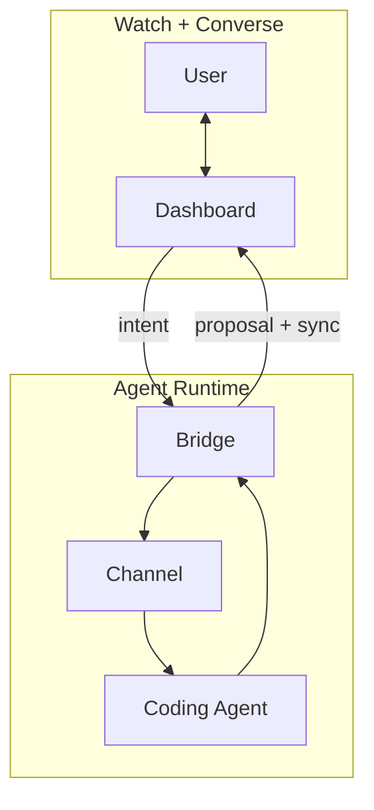

<div align="center">


# ANA — Agent‑Native Agent

### 보면서 대화하는 것만으로 운영하는 앱을 만드세요.

[](https://github.com/tykimos/agent-native-agent/stargazers)
[](LICENSE)
[](https://claude.com/claude-code)
[](channel-core.js)
[](https://github.com/tykimos/agent-native-agent/commits/main)
[](#contributing)

[English](README.md) · **한국어**

<br/>


</div>

---

## 요약(TL;DR)

**ANA는 _Agent‑Native Lifestyle_(ANL)을 위한 _Agent‑Native Agent_입니다.** 실시간 대시보드를 **보면서(watch)**, 런타임 역할을 하는 코딩 에이전트와 **대화하는(converse)** 것만으로 운영하는 셀프‑호스팅 앱입니다. 새로운 동작이 필요하신가요? 한 번 말하기만 하면 됩니다 — ANA가 변경안을 제안하고, 승인 시 적용하며, 런타임에서 앱을 진화시킵니다. PR도, 배포 단계도 없습니다 — 실행 중인 에이전트가 앱을 즉석에서 다시 쓰고 대시보드가 새로고침됩니다.

> 사용 = 제작. 그것이 핵심의 전부입니다.

---

## 어시스턴트가 아니라 에이전트인 이유

어시스턴트는 지시를 기다립니다. 에이전트는 판단하고, 실행하며, 당신의 업무를 둘러싼 도구를 스스로 개선합니다. 오늘날 모든 도구는 여전히 **사용하기**와 **만들기** 사이의 절충을 강요합니다 — ANA는 그 간극을 없앱니다.

|  | SaaS / 앱 | No‑code | 챗봇 | 코딩 에이전트 | **ANA** |
|---|:---:|:---:|:---:|:---:|:---:|
| 즉시 사용 | ✅ | ✅ | ✅ | ❌ | ✅ |
| *무엇이든* 변경 | ❌ | ⚠️ 정해진 범위 내 | ❌ | ✅ | ✅ |
| 실시간 데이터를 봄 | ✅ | ✅ | ⚠️ | ⚠️ | ✅ |
| **사용하면서 바로 변경 — 같은 대화에서** | ❌ | ❌ | ❌ | ⚠️ | ✅ |
| 완전한 소유(셀프‑호스팅) | ❌ | ❌ | ❌ | ✅ | ✅ |

SaaS는 *즉시 쓸 수 있지만 고정*되어 있습니다. 코딩 에이전트는 *무한히 유연하지만 빌드 타임 전용* — 만든 뒤에 씁니다. **ANA는 앱을 사용하는 행위(말하기)를 곧 만드는 행위(동작 변경)와 동일하게 만듭니다.** 에이전트가 런타임에 네이티브로 존재하기 때문입니다.

---

## 세 가지 원칙

1. **Watch + Converse** — 시각적 상태와 대화가 *하나의* 화면 안에 함께 있습니다. 고정된 UI를 클릭하는 대신, 보고 말하는 것으로 운영합니다.
2. **Agent as Runtime** — 에이전트가 당신의 데이터를 읽고, 행동하며, 요청 시 **앱 자체의 코드를 다시 씁니다**. 추론(inference)이 곧 런타임입니다.
3. **Own Your Harness** — 의존성 없이, 셀프‑호스팅으로, 영원히 당신의 것입니다. 당신과 함께 계속 진화합니다.

이 원칙들은 이 하네스로 만든 모든 ANA의 수용 기준이기도 합니다.

---

## 작동 방식



인바운드 메시지는 채널을 통해 전달됩니다. 아웃바운드 에이전트 응답은 대시보드 API를 통해 돌아오므로, ANA는 풍부한 전/후 제안과 승인 카드를 보여줄 수 있습니다. 상태는 버전 관리되며, 모든 기기가 동기화됩니다. **에이전트가 곧 백엔드입니다** — 따로 작성할 서버 로직이 없으며, 말하는 것으로 앱을 키워 나갑니다.

---

## 빠른 시작 — 베이스 실행 (2분)

**사전 요구사항:** Node ≥ 20, tmux, 그리고 코딩 에이전트 CLI(예: [Claude Code](https://claude.com/claude-code)). `npm install` 불필요 — 의존성이 없습니다.

```bash
git clone https://github.com/tykimos/agent-native-agent
cd agent-native-agent

# 1) tmux 안에서 코딩 에이전트를 먼저 띄웁니다
tmux new -s ana          # 세션 안에서 실행:  claude   (또는 아무 에이전트 CLI)

# 2) 다른 터미널에서 ANA 서버를 띄웁니다
node server.js           # → http://localhost:8809
```

**http://localhost:8809**을 열고 **ANA 모드**를 켠 뒤 대화하세요. **실행 스크립트가 따로 없습니다** — 서버가 연결 시 tmux 페인을 자동 설정(스크롤백 보존)합니다. 런타임 상태는 `.ana/`에 저장됩니다(git 제외).

레퍼런스 대시보드에는 **ANA 모드**(요소를 클릭해 컨텍스트 칩으로 고정), 크기 조절 가능한 도킹 채팅, **진화 탭**(변경을 요청 → 승인하면 실행 중인 에이전트가 앱을 직접 수정)이 들어 있습니다.

---

## 기존 서비스에 ANA 붙이기 (아주 간단)

**런타임 전체가 의존성 없는 한 파일 [`channel-core.js`](channel-core.js)** 입니다. 넣고 마운트하기만 하면 됩니다:

```js
const path = require('node:path');
const core = require('./channel-core.js');
const app = core.createChannelServer({
  PORT: 8809, BIND: '127.0.0.1',
  SESSION: process.env.TMUX_SESSION || 'ana',
  SOCKET: process.env.TMUX_SOCKET || '',
  TARGET: core.resolveTarget(__dirname, process.env),
  FEED_FILE: path.join(__dirname, '.ana', 'transcript.jsonl'),
  SERVABLE: new Set(['index.html']),   // 당신의 대시보드 파일(들)
  defaultDoc: 'index.html',
  autoConfigPane: true,
});
app.listen(() => console.log('ANA → http://localhost:8809'));
```

그리고 페이지에서: `POST /api/chat {text, force:true}` 로 보내고 `GET /api/stream`(SSE)으로 받습니다. 이게 통합의 전부입니다. 단계별 설명과 엔드포인트 레퍼런스는 **[`ana` 스킬](skills/ana/SKILL.md)** 에 있습니다 — Claude Code에 설치하면 스킬이 당신의 앱에 ANA를 대신 연결해 줍니다:

```bash
# Claude Code 플러그인/스킬로 사용
cp -r skills/ana ~/.claude/skills/           # 그런 다음: "내 앱에 ANA 붙여줘"
```

---

## 저장소 구성

```
channel-core.js     ★ ANA 런타임 전부 — tmux 주입 / capture-pane 미러 / 원장 (의존성 0)
server.js             베이스 앱: channel-core + dashboard-api 마운트, dashboard.html 제공
dashboard-api.js      리치 응답 API 예시 (할일 · 일정 · 메모 · 진화, diff→승인)
dashboard.html        레퍼런스 UI: ANA 모드, 컨텍스트 칩, 도킹 채팅, 진화 탭
test.cjs              57개 테스트 (단위 + mock_agent.py 대상 통합)
mock_agent.py         테스트용 결정적 TUI 스탠드인
skills/ana/SKILL.md   "서비스에 ANA 붙이기" — 위 간단 레시피
.claude-plugin/       Claude Code 플러그인 매니페스트
```

`channel-core.js`는 재사용 가능한 코어이고, `dashboard-api.js` / `dashboard.html`은 복사해서 당신의 것으로 교체하는 **예시**입니다.

---

## ANA와 ANL

| 이름 | 읽는 법 | 의미 | 역할 |
|---|---|---|---|
| **ANA** | 아나 | Agent‑Native Agent | 앱을 이해하고, 행동하며, 개선하는 자율 에이전트. |
| **ANL** | 아넬 | Agent‑Native Lifestyle | 에이전트와 함께 일하고, 배우고, 창작하고, 일상 루틴을 꾸리는 새로운 방식. |

**ANA가 ANL을 가능하게 합니다.** 실제 ANL 사례 — ANA로 만든 라이프스타일 — 는 동반 저장소인 **[agent‑native‑lifestyle](https://github.com/tykimos/agent-native-lifestyle)**에 있습니다.

---

## Star History

<a href="https://www.star-history.com/#tykimos/agent-native-agent&Date">
  <picture>
    <source media="(prefers-color-scheme: dark)" srcset="https://api.star-history.com/svg?repos=tykimos/agent-native-agent&type=Date&theme=dark" />
    <source media="(prefers-color-scheme: light)" srcset="https://api.star-history.com/svg?repos=tykimos/agent-native-agent&type=Date" />
    
  </picture>
</a>

---

## 기여하기(Contributing)

ANA는 **소유하고 진화시키기** 위한 것입니다 — 이 저장소도 마찬가지입니다. 이슈, 아이디어, PR 모두 환영합니다. 구성 요소나 예제를 추가하는 방법은 [CONTRIBUTING.md](CONTRIBUTING.md)를 참고하세요.

ANA로 무언가를 만들었다면, **[agent‑native‑lifestyle](https://github.com/tykimos/agent-native-lifestyle)** 갤러리에 추가해 ANL이 실제 사용 사례로 계속 드러나도록 해주세요.

ANA가 앱에 대한 당신의 생각을 바꿨다면, 다른 사람들도 찾을 수 있도록 **⭐ 저장소에 스타**를 눌러주세요.

---

## 라이선스(License)

[AGPL-3.0](LICENSE) © [tykimos](https://github.com/tykimos) · 주식회사 인공지능팩토리

자유롭게 사용·수정·셀프호스팅할 수 있습니다. 다만 수정본을 네트워크 서비스로 제공하면 AGPL 제13조에 따라 소스를 공개해야 합니다. 비공개 제품이나 호스팅 서비스로 쓰시려면 **[상용 라이선스](COMMERCIAL.ko.md)**를 문의해 주세요.
