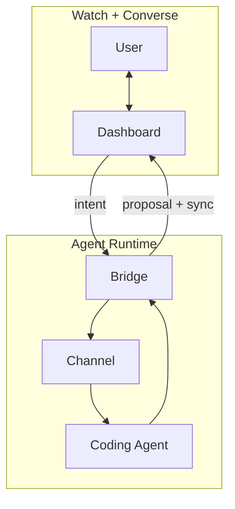

<div align="center">


# ANA — Agent‑Native Agent

### 보면서 대화하는 것만으로 운영하는 앱을 만드세요.

[](https://github.com/tykimos/agent-native-agent/stargazers)
[](LICENSE)
[](https://claude.com/claude-code)
[](https://modelcontextprotocol.io)
[](https://github.com/tykimos/agent-native-agent/commits/main)
[](#contributing)

[English](README.md) · **한국어**

<br/>


</div>

---

## 요약(TL;DR)

**ANA는 _Agent‑Native Lifestyle_(ANL)을 위한 _Agent‑Native Agent_입니다.** 실시간 대시보드를 **보면서(watch)**, 런타임 역할을 하는 코딩 에이전트와 **대화하는(converse)** 것만으로 운영하는 셀프‑호스팅 앱입니다. 새로운 동작이 필요하신가요? 한 번 말하기만 하면 됩니다 — ANA가 변경안을 제안하고, 승인 시 적용하며, 런타임에서 앱을 진화시킵니다. PR도, 배포 단계도 없습니다 — 실행 중인 에이전트가 앱을 즉석에서 다시 쓰고 대시보드가 새로고침됩니다.

> 사용 = 제작. 그것이 핵심의 전부입니다.

---

## 어시스턴트가 아니라 에이전트인 이유

어시스턴트는 지시를 기다립니다. 에이전트는 판단하고, 실행하며, 당신의 업무를 둘러싼 도구를 스스로 개선합니다. 오늘날 모든 도구는 여전히 **사용하기**와 **만들기** 사이의 절충을 강요합니다 — ANA는 그 간극을 없앱니다.

|  | SaaS / 앱 | No‑code | 챗봇 | 코딩 에이전트 | **ANA** |
|---|:---:|:---:|:---:|:---:|:---:|
| 즉시 사용 | ✅ | ✅ | ✅ | ❌ | ✅ |
| *무엇이든* 변경 | ❌ | ⚠️ 정해진 범위 내 | ❌ | ✅ | ✅ |
| 실시간 데이터를 봄 | ✅ | ✅ | ⚠️ | ⚠️ | ✅ |
| **사용하면서 바로 변경 — 같은 대화에서** | ❌ | ❌ | ❌ | ⚠️ | ✅ |
| 완전한 소유(셀프‑호스팅) | ❌ | ❌ | ❌ | ✅ | ✅ |

SaaS는 *즉시 쓸 수 있지만 고정*되어 있습니다. 코딩 에이전트는 *무한히 유연하지만 빌드 타임 전용* — 만든 뒤에 씁니다. **ANA는 앱을 사용하는 행위(말하기)를 곧 만드는 행위(동작 변경)와 동일하게 만듭니다.** 에이전트가 런타임에 네이티브로 존재하기 때문입니다.

---

## 세 가지 원칙

1. **Watch + Converse** — 시각적 상태와 대화가 *하나의* 화면 안에 함께 있습니다. 고정된 UI를 클릭하는 대신, 보고 말하는 것으로 운영합니다.
2. **Agent as Runtime** — 에이전트가 당신의 데이터를 읽고, 행동하며, 요청 시 **앱 자체의 코드를 다시 씁니다**. 추론(inference)이 곧 런타임입니다.
3. **Own Your Harness** — 의존성 없이, 셀프‑호스팅으로, 영원히 당신의 것입니다. 당신과 함께 계속 진화합니다.

이 원칙들은 이 하네스로 만든 모든 ANA의 수용 기준이기도 합니다.

---

## 작동 방식



인바운드 메시지는 채널을 통해 전달됩니다. 아웃바운드 에이전트 응답은 대시보드 API를 통해 돌아오므로, ANA는 풍부한 전/후 제안과 승인 카드를 보여줄 수 있습니다. 상태는 버전 관리되며, 모든 기기가 동기화됩니다. **에이전트가 곧 백엔드입니다** — 따로 작성할 서버 로직이 없으며, 말하는 것으로 앱을 키워 나갑니다.

---

## 스킬 설치 (30초)

> **사전 요구사항:** [Claude Code](https://claude.com/claude-code) 설치. *실행되는* 앱을 먼저 보고 싶으신가요? [템플릿으로 시작하기](#템플릿으로-시작하기) → `node server.js`.

```bash
git clone https://github.com/tykimos/agent-native-agent
cp -r agent-native-agent/skills/* ~/.claude/skills/
```

그런 다음 **Claude Code**에서 앱을 설명하기만 하면 됩니다:

```text
"Build a weekly family planner as an agent native agent"
"Add voice input to this ANA"        # ← 진화: 한 문장, 배포 없이
"Put an at-a-glance progress bar on top"
```

`agent-native-app-harness` 오케스트레이터 스킬이 트리거되어 당신의 ANA를 만듭니다: **한 화면 정의 → 디자인 → 연결 → 진화 루프 실행.** 단계별 설명은 [`build-workflow.md`](skills/agent-native-app-harness/references/build-workflow.md)에 있습니다.

---

## 템플릿으로 시작하기

빈 화면부터 만들고 싶지 않으신가요? **[ana‑starter](https://github.com/tykimos/ana-starter)**는 바로 실행 가능한 ANA입니다 — 레퍼런스 대시보드와 **동일한 디자인 시스템, 로고, 런타임**을 갖췄으며, 말하는 것으로 키워 나가는 간단한 메뉴를 제공합니다.

<div align="center">

[](https://github.com/tykimos/ana-starter/generate)


</div>

```bash
# GitHub → "Use this template", then in your clone:
node server.js        # → http://localhost:8777   (npm start / node start.js also work)
```

대시보드 + fakechat 릴레이가 함께 제공됩니다. **fakechat 채널**로 Claude Code 세션을 연결하면 watch→converse 루프가 완성됩니다(`npm run all`은 서버 + 릴레이를 함께 시작합니다). 자세한 내용은 [starter README](https://github.com/tykimos/ana-starter#connect-a-coding-agent-the-full-loop)를 참고하세요.

---

## 구성 요소(Building blocks)

| 스킬 | 계층 | 역할 |
|---|---|---|
| [`agent-native-app-harness`](skills/agent-native-app-harness/) | **오케스트레이터** | ANA를 만들기 위해 *무엇을, 어떤 순서로 조립할지*를 정의하고 진화 루프를 실행합니다. |
| [`uxui-design-system`](skills/uxui-design-system/) | 구성 요소 — *얼굴* | 의존성 없는 Toss 스타일 디자인 시스템: 대시보드의 시각적 맥락. |
| [`fakechat-dashboard-agent`](skills/fakechat-dashboard-agent/) | 구성 요소 — *신경계* | watch + converse를 위해 대시보드 + 채널 + 코딩 에이전트를 연결합니다. |

> 상단의 데모 GIF는 **"Work Secretary"** ANA입니다 — 여섯 개 채널(메일 · Slack · KakaoTalk · 결재 · 캘린더 · SMS)을 하나의 보드로 합치고, 긴급도순으로 정렬하며, 말하는 것으로 진화시킵니다.

---

## ANA와 ANL

| 이름 | 읽는 법 | 의미 | 역할 |
|---|---|---|---|
| **ANA** | 아나 | Agent‑Native Agent | 앱을 이해하고, 행동하며, 개선하는 자율 에이전트. |
| **ANL** | 아넬 | Agent‑Native Lifestyle | 에이전트와 함께 일하고, 배우고, 창작하고, 일상 루틴을 꾸리는 새로운 방식. |

**ANA가 ANL을 가능하게 합니다.** 실제 ANL 사례 — ANA로 만든 라이프스타일 — 는 동반 저장소인 **[agent‑native‑lifestyle](https://github.com/tykimos/agent-native-lifestyle)**에 있습니다.

---

## Star History

<a href="https://www.star-history.com/#tykimos/agent-native-agent&Date">
  <picture>
    <source media="(prefers-color-scheme: dark)" srcset="https://api.star-history.com/svg?repos=tykimos/agent-native-agent&type=Date&theme=dark" />
    <source media="(prefers-color-scheme: light)" srcset="https://api.star-history.com/svg?repos=tykimos/agent-native-agent&type=Date" />
    
  </picture>
</a>

---

## 기여하기(Contributing)

ANA는 **소유하고 진화시키기** 위한 것입니다 — 이 저장소도 마찬가지입니다. 이슈, 아이디어, PR 모두 환영합니다. 구성 요소나 예제를 추가하는 방법은 [CONTRIBUTING.md](CONTRIBUTING.md)를 참고하세요.

ANA로 무언가를 만들었다면, **[agent‑native‑lifestyle](https://github.com/tykimos/agent-native-lifestyle)** 갤러리에 추가해 ANL이 실제 사용 사례로 계속 드러나도록 해주세요.

ANA가 앱에 대한 당신의 생각을 바꿨다면, 다른 사람들도 찾을 수 있도록 **⭐ 저장소에 스타**를 눌러주세요.

---

## 라이선스(License)

[MIT](LICENSE) © [tykimos](https://github.com/tykimos)
