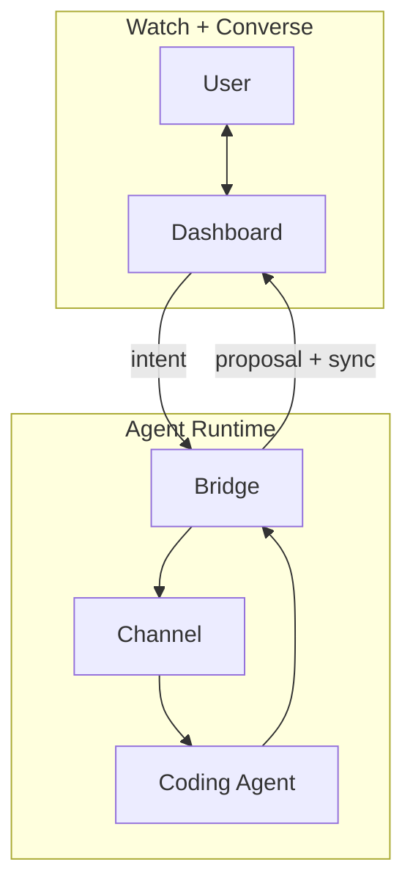

<div align="center">

# ⟁ ANA — Agent Native Agent

### An agent-native agent for **Agent-Native Lifestyle**.

ANA (read: **Ana**) is an agent-native agent for ANL (read: **Anel**) — **Agent-Native Lifestyle**, a way of working and living where agents understand your routines, act on your behalf, and keep improving the tools around you.

[](https://github.com/tykimos/agent-native-agent/stargazers)
[](LICENSE)
[](https://claude.com/claude-code)
[](https://modelcontextprotocol.io)
[](https://github.com/tykimos/agent-native-agent/commits/main)
[](#contributing)

**English** · [Korean](README.ko.md)

</div>

---

## TL;DR

**ANA is an _agent-native agent_ for _Agent-Native Lifestyle_ (ANL).**
It is not a passive assistant that waits for instructions. It is an autonomous agent that watches context, reasons, acts, and repeatedly improves the app around your work and life.

You operate ANA by **watching** a live dashboard and **conversing** with the agent. When you need a new behavior, you ask once — and ANA can propose the change, apply it with approval, and evolve the app at runtime.

> **ANA is an agent-native agent for Agent-Native Lifestyle.**

---

## ANA and ANL

| Name | Reads as | Means | Role |
|---|---|---|---|
| **ANA** | Ana | Agent Native Agent | The autonomous agent that understands, acts, and improves. |
| **ANL** | Anel | Agent-Native Lifestyle | The new way of working, learning, creating, consuming, and running daily routines with agents. |

**ANA enables ANL.** ANL is shown through concrete examples inside this repository: [`examples/`](examples/).

---

## Why Agent, Not Assistant

An assistant sounds helpful but passive. An agent implies judgment, execution, feedback loops, and improvement. That is the point of ANA: the user is not merely asking for help; the user is growing a lifestyle where the agent can act.

Every tool today still forces a trade‑off between **using** and **building**:

|  | SaaS / Apps | No‑code | Chatbots | Coding agents | **ANA** |
|---|:---:|:---:|:---:|:---:|:---:|
| Use it instantly | ✅ | ✅ | ✅ | ❌ | ✅ |
| Change *anything* | ❌ | ⚠️ in‑box | ❌ | ✅ | ✅ |
| Sees your live data | ✅ | ✅ | ❌ | ⚠️ | ✅ |
| **Change at runtime — no deploy** | ❌ | ❌ | ❌ | ❌ | ✅ |
| You fully own it (self‑host) | ❌ | ❌ | ❌ | ✅ | ✅ |

SaaS is *instant but frozen*. Coding agents are *infinitely malleable but build‑time only* — you ship, then use. **ANA collapses build‑time into run‑time:** because the agent is native to the runtime, **using the app (talking) is the same act as building it (changing behavior).**

> Use = Build. That's the whole idea.

---

## The Three Principles

1. **Watch + Converse** — visual state and a chat live in *one* view. You operate by looking and talking, not clicking through fixed UI.
2. **Agent as Runtime** — the agent reads your data → acts → and **rewrites the app's own code** when asked. Inference is the runtime.
3. **Own Your Harness** — zero dependencies, self‑hosted, yours forever. It keeps evolving with you.

These principles are also the acceptance criteria for every ANA built with this harness.

---

## How it works



Inbound messages travel through the channel. Outbound agent responses return through the dashboard API, so ANA can show rich before/after proposals and approval cards. State is versioned, and every device syncs.

The agent is the backend. There is no separate server logic to write — you grow it by talking.

---

## Quickstart

```bash
git clone https://github.com/tykimos/agent-native-agent
cp -r agent-native-agent/skills/* ~/.claude/skills/
```

Then, in **Claude Code**, just describe the app:

```text
"Build a weekly family planner as an agent native agent"
"Add voice input to this ANA"        # ← evolve: one sentence, no deploy
"Put an at-a-glance progress bar on top"
```

The `agent-native-app-harness` orchestrator skill triggers and builds your ANA: **define one screen → design → wire up → run the evolution loop.** Step‑by‑step in [`build-workflow.md`](skills/agent-native-app-harness/references/build-workflow.md).

---

## Building blocks

| Skill | Layer | Role |
|---|---|---|
| [`agent-native-app-harness`](skills/agent-native-app-harness/) | **Orchestrator** | Defines *what to assemble, in what order* to build an ANA, and runs the evolution loop. |
| [`uxui-design-system`](skills/uxui-design-system/) | Building block — *the face* | Zero‑dependency, Toss‑style design system: the dashboard's visual context. |
| [`fakechat-dashboard-agent`](skills/fakechat-dashboard-agent/) | Building block — *the nervous system* | Wires dashboard + channel + coding agent for watch + converse. |

---

## Example — a real ANA in 60 seconds

**"Work Secretary"** — six channels (mail · Slack · KakaoTalk · approvals · calendar · SMS) collapsed into one board, sorted by urgency.

- **Watch:** a live status board of everything that needs you.
- **Converse:** *"Approve this expense and send the reply mail."*
- **Flow:** chat → channel → the agent reads state → returns a **before/after preview + approve card** → tap → applied, every device synced.
- **Evolve:** *"Add a weekly throughput metric."* → it appears. No dev cycle — one sentence.

> The demo above is an ANA built with this harness.

More ANL examples live in [`examples/`](examples/). They are not a separate repository; they are concrete lifestyle cases made with ANA.

---

## Roadmap

- [ ] One‑command scaffolder (`npx create-ana`)
- [ ] More building blocks (auth gate, audit log, multi‑user)
- [ ] Template gallery (planner, CRM‑lite, order desk, work queue)
- [ ] Hosted quickstart tunnel

---

## Star History

<a href="https://www.star-history.com/#tykimos/agent-native-agent&Date">
  <picture>
    <source media="(prefers-color-scheme: dark)" srcset="https://api.star-history.com/svg?repos=tykimos/agent-native-agent&type=Date&theme=dark" />
    <source media="(prefers-color-scheme: light)" srcset="https://api.star-history.com/svg?repos=tykimos/agent-native-agent&type=Date" />
    
  </picture>
</a>

---

## Contributing

ANA is meant to be **owned and evolved** — that includes this repo. Issues, ideas, and PRs are welcome.
If you are publishing examples made with ANA, add them under [`examples/`](examples/) so ANL stays visible as real usage, not a separate product.
If ANA changes how you think about apps, **⭐ star the repo** so others can find it.

---

## License

[MIT](LICENSE) © [tykimos](https://github.com/tykimos)
