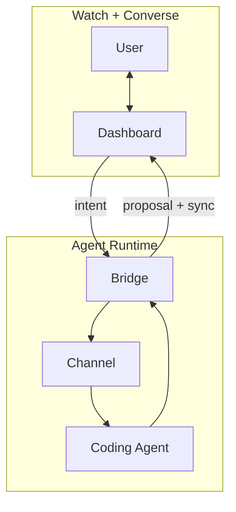
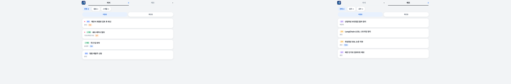

<div align="center">


# ANA — Agent‑Native Agent

### Build apps you operate by watching and talking.

[](https://github.com/tykimos/agent-native-agent/stargazers)
[](LICENSE)
[](https://claude.com/claude-code)
[](https://modelcontextprotocol.io)
[](https://github.com/tykimos/agent-native-agent/commits/main)
[](#contributing)

**English** · [한국어](README.ko.md)

<br/>


</div>

---

## TL;DR

**ANA is an _Agent‑Native Agent_ for _Agent‑Native Lifestyle_ (ANL).** It is a self‑hosted app you operate by **watching** a live dashboard and **conversing** with a coding agent that serves as the runtime. Need a new behavior? Ask once — ANA proposes the change, applies it on approval, and evolves the app at runtime. No PR, no ship step — the running agent rewrites the app live and the dashboard reloads.

> Use = Build. That's the whole idea.

---

## Why Agent, Not Assistant

An assistant waits for instructions. An agent uses judgment, executes, and improves the tools around your work. Every tool today still forces a trade‑off between **using** and **building** — ANA collapses that gap.

|  | SaaS / Apps | No‑code | Chatbots | Coding agents | **ANA** |
|---|:---:|:---:|:---:|:---:|:---:|
| Use it instantly | ✅ | ✅ | ✅ | ❌ | ✅ |
| Change *anything* | ❌ | ⚠️ in‑box | ❌ | ✅ | ✅ |
| Sees your live data | ✅ | ✅ | ⚠️ | ⚠️ | ✅ |
| **Change it while using it — same conversation** | ❌ | ❌ | ❌ | ⚠️ | ✅ |
| You fully own it (self‑host) | ❌ | ❌ | ❌ | ✅ | ✅ |

SaaS is *instant but frozen*. Coding agents are *infinitely malleable but build‑time only* — you ship, then use. **ANA makes using the app (talking) the same act as building it (changing behavior),** because the agent is native to the runtime.

---

## The Three Principles

1. **Watch + Converse** — visual state and chat live in *one* view. You operate by looking and talking, not clicking through fixed UI.
2. **Agent as Runtime** — the agent reads your data, acts, and **rewrites the app's own code** when asked. Inference is the runtime.
3. **Own Your Harness** — zero dependencies, self‑hosted, yours forever. It keeps evolving with you.

These are also the acceptance criteria for every ANA built with this harness.

---

## How it works


```mermaid
flowchart TB
  subgraph UX["Watch + Converse"]
    direction LR
    U["User"] <--> D["Dashboard"]
  end

  subgraph RT["Agent Runtime"]
    direction LR
    B["Bridge"] --> C["Channel"]
    C --> A["Coding Agent"]
    A --> B
  end

  D -->|"intent"| B
  B -->|"proposal + sync"| D
```

Inbound messages travel through the channel. Outbound agent responses return through the dashboard API, so ANA can show rich before/after proposals and approval cards. State is versioned, and every device syncs. **The agent is the backend** — there's no separate server logic to write; you grow it by talking.

---

## Install the skills (30 s)

> **Prerequisite:** [Claude Code](https://claude.com/claude-code) installed. Want a *running* app first, no setup? Jump to [Start from a template](#start-from-a-template) → `node server.js`.

```bash
git clone https://github.com/tykimos/agent-native-agent
cp -r agent-native-agent/skills/* ~/.claude/skills/
```

Then, in **Claude Code**, just describe the app:

```text
"Build a weekly family planner as an agent native agent"
"Add voice input to this ANA"        # ← evolve: one sentence, no deploy
"Put an at-a-glance progress bar on top"
```

The `agent-native-app-harness` orchestrator skill triggers and builds your ANA: **define one screen → design → wire up → run the evolution loop.** Step‑by‑step in [`build-workflow.md`](skills/agent-native-app-harness/references/build-workflow.md).

---

## Start from a template

Don't want to build from an empty screen? **[ana‑starter](https://github.com/tykimos/ana-starter)** is a ready‑to‑run ANA — the **same design system, logo, and runtime** as the reference dashboard — with a simple menu you grow by talking.

<div align="center">

[](https://github.com/tykimos/ana-starter/generate)



</div>

```bash
# GitHub → "Use this template", then in your clone:
node server.js        # → http://localhost:8777   (npm start / node start.js also work)
```

It ships the dashboard + fakechat relay. Connect a Claude Code session with the **fakechat channel** to complete the watch→converse loop (`npm run all` starts server + relay together). Details in the [starter README](https://github.com/tykimos/ana-starter#connect-a-coding-agent-the-full-loop).

---

## Building blocks

| Skill | Layer | Role |
|---|---|---|
| [`agent-native-app-harness`](skills/agent-native-app-harness/) | **Orchestrator** | Defines *what to assemble, in what order* to build an ANA, and runs the evolution loop. |
| [`uxui-design-system`](skills/uxui-design-system/) | Building block — *the face* | Zero‑dependency, Toss‑style design system: the dashboard's visual context. |
| [`fakechat-dashboard-agent`](skills/fakechat-dashboard-agent/) | Building block — *the nervous system* | Wires dashboard + channel + coding agent for watch + converse. |
| [`realtime-mirror-channel`](skills/realtime-mirror-channel/) | Building block — *the senses* | Real‑time two‑way link: inbound relay + **mirrors the session** (your input, its tool calls, its answers) onto the screen as it happens. |
| [`content-studio`](skills/content-studio/) | Building block — *the content body* | The **document‑editing** form of ANA: watch a document, tap an element to pin it as a chip, and edit it by talking — the agent rewrites the source and re‑renders. |

**Two shapes of ANA** — same principles, different *watch* target:

| Shape | You watch | Assemble | Examples |
|---|---|---|---|
| **Dashboard** (default) | state · lists · metrics | `uxui-design-system` + `fakechat-dashboard-agent` (+ `realtime-mirror-channel`) | work board, weekly planner, order queue |
| **Content studio** | the document itself | `content-studio` + `realtime-mirror-channel` (+ `uxui-design-system`) | textbook/manual editing, report layout, slides |

> The demo GIF at the top is the **"Work Secretary"** ANA — six channels (mail · Slack · KakaoTalk · approvals · calendar · SMS) collapsed into one board, sorted by urgency, evolved by talking.

---

## ANA and ANL

| Name | Reads as | Means | Role |
|---|---|---|---|
| **ANA** | Ana | Agent‑Native Agent | The autonomous agent that understands, acts, and improves the app. |
| **ANL** | Anel | Agent‑Native Lifestyle | The new way of working, learning, creating, and running daily routines with agents. |

**ANA enables ANL.** Real ANL cases — lifestyles built with ANA — live in the companion repo: **[agent‑native‑lifestyle](https://github.com/tykimos/agent-native-lifestyle)**.

---

## Star History

<a href="https://www.star-history.com/#tykimos/agent-native-agent&Date">
  <picture>
    <source media="(prefers-color-scheme: dark)" srcset="https://api.star-history.com/svg?repos=tykimos/agent-native-agent&type=Date&theme=dark" />
    <source media="(prefers-color-scheme: light)" srcset="https://api.star-history.com/svg?repos=tykimos/agent-native-agent&type=Date" />
    
  </picture>
</a>

---

## Contributing

ANA is meant to be **owned and evolved** — that includes this repo. Issues, ideas, and PRs are welcome; see [CONTRIBUTING.md](CONTRIBUTING.md) for how to add building blocks or examples.

If you build something with ANA, add it to the **[agent‑native‑lifestyle](https://github.com/tykimos/agent-native-lifestyle)** gallery so ANL stays visible as real usage.

If ANA changes how you think about apps, **⭐ star the repo** so others can find it.

---

## License

[AGPL-3.0](LICENSE) © [tykimos](https://github.com/tykimos) · AI Factory Inc.

Free to use, modify, and self-host. If you run a modified version as a network service, AGPL §13 requires you to publish your source. Building something closed-source or hosted? A **[commercial license](COMMERCIAL.md)** is available.
