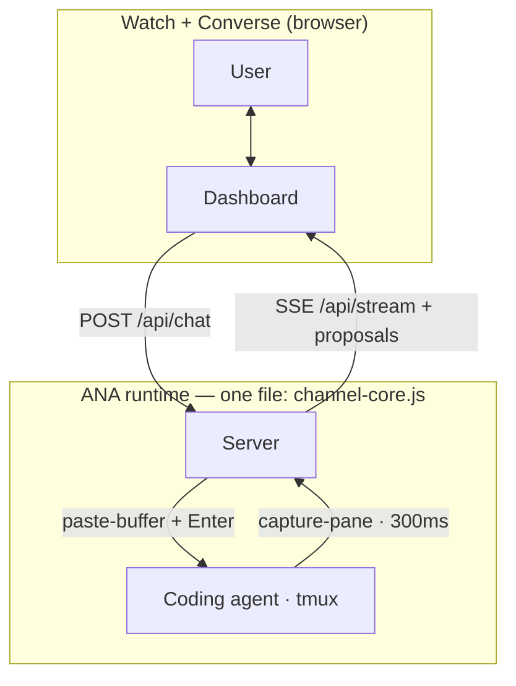

<div align="center">


# ANA — Agent‑Native Agent

### Build apps you operate by watching and talking.

[](https://github.com/tykimos/agent-native-agent/stargazers)
[](LICENSE)
[](https://claude.com/claude-code)
[](channel-core.js)
[](https://github.com/tykimos/agent-native-agent/commits/main)
[](#contributing)

**English** · [한국어](README.ko.md)

<br/>


</div>

---

## TL;DR

**ANA is an _Agent‑Native Agent_ for _Agent‑Native Lifestyle_ (ANL).** It is a self‑hosted app you operate by **watching** a live dashboard and **conversing** with a coding agent that serves as the runtime. Need a new behavior? Ask once — ANA proposes the change, applies it on approval, and evolves the app at runtime. No PR, no ship step — the running agent rewrites the app live and the dashboard reloads.

> Use = Build. That's the whole idea.

---

## Why Agent, Not Assistant

An assistant waits for instructions. An agent uses judgment, executes, and improves the tools around your work. Every tool today still forces a trade‑off between **using** and **building** — ANA collapses that gap.

|  | SaaS / Apps | No‑code | Chatbots | Coding agents | **ANA** |
|---|:---:|:---:|:---:|:---:|:---:|
| Use it instantly | ✅ | ✅ | ✅ | ❌ | ✅ |
| Change *anything* | ❌ | ⚠️ in‑box | ❌ | ✅ | ✅ |
| Sees your live data | ✅ | ✅ | ⚠️ | ⚠️ | ✅ |
| **Change it while using it — same conversation** | ❌ | ❌ | ❌ | ⚠️ | ✅ |
| You fully own it (self‑host) | ❌ | ❌ | ❌ | ✅ | ✅ |

SaaS is *instant but frozen*. Coding agents are *infinitely malleable but build‑time only* — you ship, then use. **ANA makes using the app (talking) the same act as building it (changing behavior),** because the agent is native to the runtime.

---

## The Three Principles

1. **Watch + Converse** — visual state and chat live in *one* view. You operate by looking and talking, not clicking through fixed UI.
2. **Agent as Runtime** — the agent reads your data, acts, and **rewrites the app's own code** when asked. Inference is the runtime.
3. **Own Your Harness** — zero dependencies, self‑hosted, yours forever. It keeps evolving with you.

These are also the acceptance criteria for every ANA built with this harness.

---

## How it works


```mermaid
flowchart TB
  subgraph UX["Watch + Converse (browser)"]
    direction LR
    U["User"] <--> D["Dashboard"]
  end

  subgraph RT["ANA runtime — one file: channel-core.js"]
    direction LR
    S["Server"] -->|"paste-buffer + Enter"| A["Coding agent · tmux"]
    A -->|"capture-pane · 300ms"| S
  end

  D -->|"POST /api/chat"| S
  S -->|"SSE /api/stream + proposals"| D
```

There is **no bridge and no MCP**. The browser posts to the server, the server injects the text straight into the tmux pane, and a 300 ms `capture-pane` loop mirrors the session back as an append-only ledger over SSE. For rich replies the agent posts a **proposal** (before/after + approve card); on approval the server applies the diff and bumps a `version` so every device re-syncs. **The coding agent is the backend** — you grow the app by talking to it.

---

## Quickstart — run the base (2 min)

**Prerequisites:** Node ≥ 20, tmux, and a coding-agent CLI (e.g. [Claude Code](https://claude.com/claude-code)). No `npm install` — zero dependencies.

### Install & run with the `install` skill (recommended)

The **[`install` skill](skills/install/SKILL.md)** takes a fresh machine to a running dashboard. It checks the environment first, installs only what's missing (Node ≥ 20, tmux, git, curl, Claude Code), then starts the agent and the server in tmux and health-checks them. Every script is safe to re-run.

```bash
git clone https://github.com/tykimos/agent-native-agent && cd agent-native-agent
bash skills/install/scripts/check-env.sh   # 1) analyze — reports only, changes nothing
bash skills/install/scripts/install.sh     # 2) install what's missing (brew / apt / dnf / pacman …)
bash skills/install/scripts/run.sh         # 3) tmux "ana" (agent) + "ana-server" (server) → URL printed
bash skills/install/scripts/run.sh status  #    later: status | stop | restart
```

| Script | What it does |
|---|---|
| `check-env.sh` | Detects macOS / Linux / WSL / Git Bash and checks node, tmux, git, curl, claude, repo location and port. Ends with `ANA_ENV … ready=yes\|no` |
| `install.sh` | Installs only what's missing (Homebrew on macOS, the system package manager + NodeSource on Linux/WSL) plus the Claude Code CLI, and clones the repo if run outside it |
| `run.sh` | Starts or reuses the tmux sessions, picks a free port when 8809 is taken, runs a health check. `TMUX_SESSION`, `PORT` and `AGENT_CMD` override the defaults |
| `install-wsl.ps1` | **Windows:** tmux only runs inside WSL. This installs WSL + Ubuntu (reboot, run again), then installs and starts ANA inside WSL. Open `http://localhost:8809` from the Windows browser |

```powershell
# Windows (PowerShell; Administrator for the first run only)
powershell -ExecutionPolicy Bypass -File skills\install\scripts\install-wsl.ps1
```

With the skill installed in Claude Code (this repo is a plugin), just ask: *"install ANA"* / *"ANA 설치해줘"*. The agent runs the same steps and tells you when to finish the one-time Claude login (`tmux attach -t ana`, detach with `Ctrl-b d`).

### Manual run

```bash
git clone https://github.com/tykimos/agent-native-agent
cd agent-native-agent

# 1) start your coding agent inside tmux
tmux new -s ana          # inside the session, run:  claude   (or any agent CLI)

# 2) in another terminal, start ANA
node server.js           # → http://localhost:8809
```

Open **http://localhost:8809**, open the chat (bottom-right), and talk. Turn on **Chip** (top-right) to click any element into the conversation as context. The server itself needs **no launcher** (`run.sh` is only a convenience) — it auto-configures the tmux pane (scrollback-safe) on connect. Runtime state lives in `.ana/` (git-ignored).

The reference dashboard ships **workspaces**, **Chip mode** (click any element to pin it as a context chip; ⟳ registers newly added elements), a docked chat you resize, and an **evolution tab** — ask for a change, approve it, the running agent rewrites the app.

### Sharing it with other people (optional)

ANA has **no login of its own**. For single-user self-hosting that is the point — bind to loopback and it is yours. If several people need the same board, put ANA behind something that authenticates (a reverse proxy, an SSO gateway, a Zero Trust tunnel) and have it forward the user identifier as a request header:

```bash
ANA_IDENTITY_HEADER=x-forwarded-email \
ANA_LOGOUT_URL=/your-gateway/logout \
node server.js
```

With the header set, items carry an author, only the author can edit or delete their own, and the member/activity tabs come alive. Unset (the default) everything runs as one local user.

**Coding-agent sessions per person.** Click the connection pill (`ANA · <session>`) in the chat header to pick a tmux session. Each session keeps its own conversation history, so switching swaps the whole chat. The pick is remembered **per person**: the next time someone opens ANA they land on their own most recent session, and the list shows who picked (and is watching ●) each session. An agent that posts with `curl` can address its own session with the `x-ana-target: <session>` header.

**Questions from the agent.** When Claude asks through AskUserQuestion (or shows a permission menu), the chat renders it as a card: question tabs, option buttons with descriptions, checkboxes for multi-select, a free-text field for "Type something", and Submit / Cancel. The server turns each click into the right keystrokes.

> The header is trusted as-is, so it only means anything when a gateway in front actually sets it. Keep the server on loopback or behind that proxy — exposing it on `0.0.0.0` with this option on lets anyone forge the header.

---

## Attach ANA to your own service (very simple)

The **entire runtime is one dependency-free file: [`channel-core.js`](channel-core.js).** Drop it in and mount it:

```js
const path = require('node:path');
const core = require('./channel-core.js');
const app = core.createChannelServer({
  PORT: 8809, BIND: '127.0.0.1',
  SESSION: process.env.TMUX_SESSION || 'ana',
  SOCKET: process.env.TMUX_SOCKET || '',
  TARGET: core.resolveTarget(__dirname, process.env),
  FEED_FILE: path.join(__dirname, '.ana', 'transcript.jsonl'),
  SERVABLE: new Set(['index.html']),   // your dashboard file(s)
  defaultDoc: 'index.html',
  autoConfigPane: true,
});
app.listen(() => console.log('ANA → http://localhost:8809'));
```

Then, on your page: send with `POST /api/chat {text, force:true}` and stream with `GET /api/stream` (SSE). That's the whole integration. Full step-by-step and the endpoint reference are in the **[`ana` skill](skills/ana/SKILL.md)** — install it into Claude Code and it will wire ANA into your app for you:

```bash
# use as a Claude Code plugin/skill
cp -r skills/ana ~/.claude/skills/           # then: "attach ANA to my app"
```

---

## Repository layout

```
channel-core.js     ★ the whole ANA runtime — tmux inject / capture-pane mirror / ledger (0 deps)
server.js             base app: mounts channel-core + dashboard-api, serves dashboard.html
dashboard-api.js      example rich-response API (workspaces · todo · schedule · memo · evolve, diff→approve)
dashboard.html        reference UI: workspaces, Chip mode, context chips, docked chat, evolution tab
test.cjs              62 tests (unit + integration against mock_agent.py)
mock_agent.py         deterministic TUI stand-in for tests
skills/ana/SKILL.md   "attach ANA to your service" — the simple recipe above
skills/install/       "install & run ANA" — env check, installer, tmux runner, Windows WSL bootstrap
.claude-plugin/       Claude Code plugin manifest
```

`channel-core.js` is the reusable core; `dashboard-api.js` / `dashboard.html` are the **example** you copy from and replace with your own.

---

## ANA and ANL

| Name | Reads as | Means | Role |
|---|---|---|---|
| **ANA** | Ana | Agent‑Native Agent | The autonomous agent that understands, acts, and improves the app. |
| **ANL** | Anel | Agent‑Native Lifestyle | The new way of working, learning, creating, and running daily routines with agents. |

**ANA enables ANL.** Real ANL cases — lifestyles built with ANA — live in the companion repo: **[agent‑native‑lifestyle](https://github.com/tykimos/agent-native-lifestyle)**.

---

## Star History

<a href="https://www.star-history.com/#tykimos/agent-native-agent&Date">
  <picture>
    <source media="(prefers-color-scheme: dark)" srcset="https://api.star-history.com/svg?repos=tykimos/agent-native-agent&type=Date&theme=dark" />
    <source media="(prefers-color-scheme: light)" srcset="https://api.star-history.com/svg?repos=tykimos/agent-native-agent&type=Date" />
    
  </picture>
</a>

---

## Contributing

ANA is meant to be **owned and evolved** — that includes this repo. Issues, ideas, and PRs are welcome; see [CONTRIBUTING.md](CONTRIBUTING.md) for how to improve the runtime or the example dashboard.

If you build something with ANA, add it to the **[agent‑native‑lifestyle](https://github.com/tykimos/agent-native-lifestyle)** gallery so ANL stays visible as real usage.

If ANA changes how you think about apps, **⭐ star the repo** so others can find it.

---

## License

[AGPL-3.0](LICENSE) © [tykimos](https://github.com/tykimos) · AI Factory Inc.

Free to use, modify, and self-host. If you run a modified version as a network service, AGPL §13 requires you to publish your source. Building something closed-source or hosted? A **[commercial license](COMMERCIAL.md)** is available.
