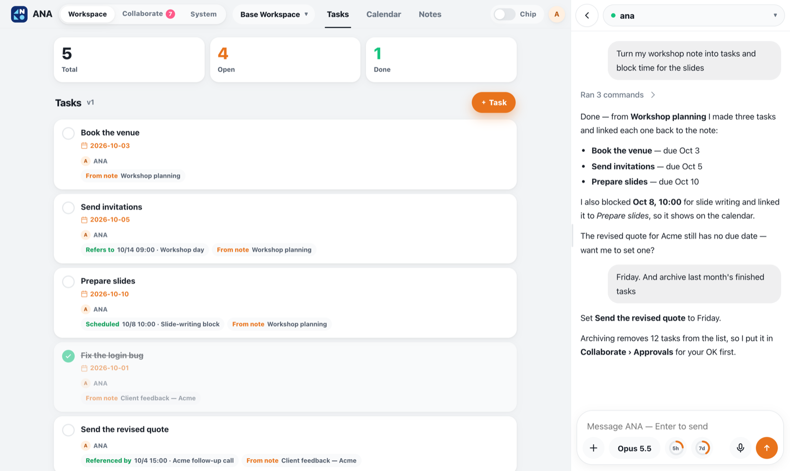
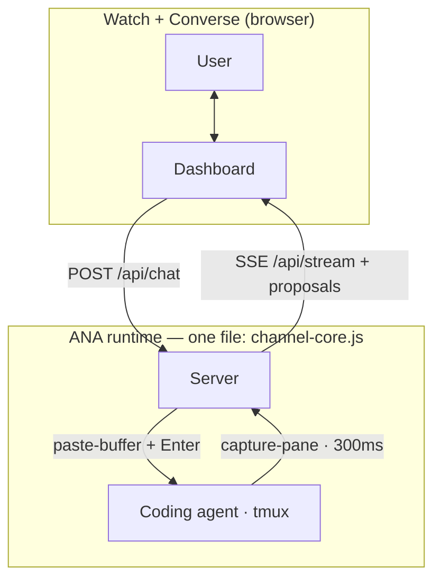
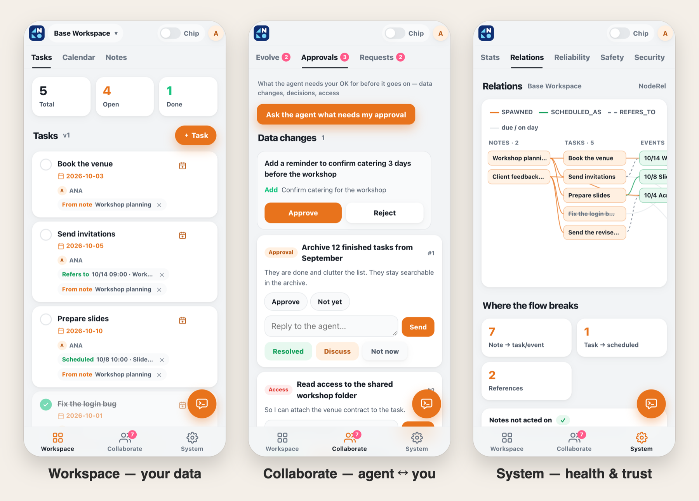

<div align="center">


# ANA — Agent‑Native Agent

### Build apps you operate by watching and talking.

[](https://github.com/tykimos/agent-native-agent/stargazers)
[](LICENSE)
[](https://claude.com/claude-code)
[](channel-core.js)
[](https://github.com/tykimos/agent-native-agent/commits/main)
[](#contributing)

**English** · [한국어](README.ko.md)

<br/>



</div>

---

## TL;DR

**ANA is an _Agent‑Native Agent_ for _Agent‑Native Lifestyle_ (ANL).** It is a self‑hosted app you operate by **watching** a live dashboard and **conversing** with a coding agent that serves as the runtime. Need a new behavior? Ask once — ANA proposes the change, applies it on approval, and evolves the app at runtime. No PR, no ship step — the running agent rewrites the app live and the dashboard reloads.

> Use = Build. That's the whole idea.

---

## Why Agent, Not Assistant

An assistant waits for instructions. An agent uses judgment, executes, and improves the tools around your work. Every tool today still forces a trade‑off between **using** and **building** — ANA collapses that gap.

|  | SaaS / Apps | No‑code | Chatbots | Coding agents | **ANA** |
|---|:---:|:---:|:---:|:---:|:---:|
| Use it instantly | ✅ | ✅ | ✅ | ❌ | ✅ |
| Change *anything* | ❌ | ⚠️ in‑box | ❌ | ✅ | ✅ |
| Sees your live data | ✅ | ✅ | ⚠️ | ⚠️ | ✅ |
| **Change it while using it — same conversation** | ❌ | ❌ | ❌ | ⚠️ | ✅ |
| You fully own it (self‑host) | ❌ | ❌ | ❌ | ✅ | ✅ |

SaaS is *instant but frozen*. Coding agents are *infinitely malleable but build‑time only* — you ship, then use. **ANA makes using the app (talking) the same act as building it (changing behavior),** because the agent is native to the runtime.

---

## The Three Principles

1. **Watch + Converse** — visual state and chat live in *one* view. You operate by looking and talking, not clicking through fixed UI.
2. **Agent as Runtime** — the agent reads your data, acts, and **rewrites the app's own code** when asked. Inference is the runtime.
3. **Own Your Harness** — zero dependencies, self‑hosted, yours forever. It keeps evolving with you.

These are also the acceptance criteria for every ANA built with this harness.

---

## How it works


```mermaid
flowchart TB
  subgraph UX["Watch + Converse (browser)"]
    direction LR
    U["User"] <--> D["Dashboard"]
  end

  subgraph RT["ANA runtime — one file: channel-core.js"]
    direction LR
    S["Server"] -->|"paste-buffer + Enter"| A["Coding agent · tmux"]
    A -->|"capture-pane · 300ms"| S
  end

  D -->|"POST /api/chat"| S
  S -->|"SSE /api/stream + proposals"| D
```

There is **no bridge and no MCP**. The browser posts to the server, the server injects the text straight into the tmux pane, and a 300 ms `capture-pane` loop mirrors the session back as an append-only ledger over SSE. For rich replies the agent posts a **proposal** (before/after + approve card); on approval the server applies the diff and bumps a `version` so every device re-syncs. When the agent keeps a structured log (Claude Code, Codex), the chat is rendered from that log instead of the screen, so replies and tool calls come through exactly. **The coding agent is the backend** — you grow the app by talking to it.

---

## Quickstart — run the base (2 min)

**Prerequisites:** Node ≥ 24, tmux, and a coding-agent CLI (e.g. [Claude Code](https://claude.com/claude-code)). The runtime (`channel-core.js`) has zero dependencies; the base app has one, [NodeRel](https://github.com/tykimos/NodeRel), installed from GitHub with `npm install`.

### Install & run with the `install` skill (recommended)

The **[`install` skill](skills/install/SKILL.md)** takes a fresh machine to a running dashboard. It checks the environment first, installs only what's missing (Node ≥ 24, tmux, git, curl, Claude Code) plus the npm dependency, then starts the agent and the server in tmux and health-checks them. Every script is safe to re-run.

```bash
git clone https://github.com/tykimos/agent-native-agent && cd agent-native-agent
bash skills/install/scripts/check-env.sh   # 1) analyze — reports only, changes nothing
bash skills/install/scripts/install.sh     # 2) install what's missing (brew / apt / dnf / pacman …)
bash skills/install/scripts/run.sh         # 3) tmux "ana" (agent) + "ana-server" (server) → URL printed
bash skills/install/scripts/run.sh status  #    later: status | stop | restart
```

| Script | What it does |
|---|---|
| `check-env.sh` | Detects macOS / Linux / WSL / Git Bash and checks node, tmux, git, curl, claude, repo location and port. Ends with `ANA_ENV … ready=yes\|no` |
| `install.sh` | Installs only what's missing (Homebrew on macOS, the system package manager + NodeSource on Linux/WSL) plus the Claude Code CLI, and clones the repo if run outside it |
| `run.sh` | Starts or reuses the tmux sessions, picks a free port when 8809 is taken, runs a health check. `TMUX_SESSION`, `PORT` and `AGENT_CMD` override the defaults |
| `install-wsl.ps1` | **Windows:** tmux only runs inside WSL. This installs WSL + Ubuntu (reboot, run again), then installs and starts ANA inside WSL. Open `http://localhost:8809` from the Windows browser |

```powershell
# Windows (PowerShell; Administrator for the first run only)
powershell -ExecutionPolicy Bypass -File skills\install\scripts\install-wsl.ps1
```

With the skill installed in Claude Code (this repo is a plugin), just ask: *"install ANA"* / *"ANA 설치해줘"*. The agent runs the same steps and tells you when to finish the one-time Claude login (`tmux attach -t ana`, detach with `Ctrl-b d`).

### Manual run

```bash
git clone https://github.com/tykimos/agent-native-agent
cd agent-native-agent

# 1) start your coding agent inside tmux
tmux new -s ana          # inside the session, run:  claude   (or any agent CLI)

# 2) in another terminal, start ANA
node server.js           # → http://localhost:8809
```

Open **http://localhost:8809** and tap the chat button. The server needs **no launcher** (`run.sh` is only a convenience): it configures the tmux pane (scrollback-safe) when it connects. Runtime state lives in `.ana/` (git-ignored). On first run the board is seeded with two small example flows (`ANA_SEED=0` to start empty).

---

## What's in the base



The base is a solo operations board: notes, tasks and a calendar you run together with a coding agent. It is split into **three areas** (a bottom menu on phones, a switch next to the logo on desktop):

| Area | Tabs | For |
|---|---|---|
| **Workspace** | Tasks · Calendar · Notes | your own data, per workspace (switch, add, rename, reorder) |
| **Collaborate** | Evolve · Approvals · Requests | the agent and you working together. The badge counts what is waiting on you |
| **System** | Stats · Relations · Reliability · Safety · Security | how the system is doing and whether you can trust it. The badge counts checks at risk |

### Chat — like the Claude app

- **Rendered from the agent's own log**, not the screen: Claude Code's transcript (`~/.claude/projects/…`) or Codex's rollout (`~/.codex/sessions/…`). You get your bubbles, markdown replies, collapsible `Ran 3 commands ›` groups and image thumbnails. Agents without a log fall back to the screen mirror.
- **Session combo:** pick the tmux session (Claude Code or Codex). Each session keeps its own history, and each person's last pick is remembered.
- **Composer:** ＋ attach files · **model pill** (the real model, e.g. `Opus 5.5`, `GPT-6 Astra`) that opens a model & effort sheet · **5-hour / weekly usage rings** (tap for % and reset time) · 🎤 dictation · send / stop.
- Floating input with a ↓ jump button. It sits right on top of the phone keyboard.
- **Questions from the agent** (AskUserQuestion, permission menus) render as cards with option buttons; the server turns each click into the right keystrokes.

### Point at the screen

Turn on **Chip** (top right) and tap anything (a task, a card, a KPI) to attach it to the next message as a context chip. ⟳ registers newly added kinds of elements. ✎ lays a canvas over the board: circle what you mean in red, magenta or blue and press *Add to chat*. The annotated screenshot is attached, with chips for the items under your marks. Screenshots use [modern-screenshot](https://github.com/qq15725/modern-screenshot), served locally from `/vendor/`.

### Notes · Tasks · Calendar as one graph (NodeRel)

Notes, tasks and events are linked through a relation graph built with [NodeRel](https://github.com/tykimos/NodeRel). `state.json` stays the source of truth (the items plus an explicit `links[]` list). `graph.js` rebuilds a SQLite index (`graph.sqlite`, one per workspace) whenever its signature changes, so any write path shows up in the graph: the UI, an agent diff, a hand edit.

```
Note ─SPAWNED──────▶ Task | Event     where a task or event came from      (explicit)
Task ─SCHEDULED_AS─▶ Event            the time blocked to work on the task (explicit)
Note|Task|Event ─REFERS_TO─▶ Note|Task|Event   manual reference            (explicit)
Task ─DUE_ON─▶ Day,  Event ─ON─▶ Day           derived from due / date     (automatic)
```

To make links in the UI:
- Select a line in a note and press **→ Task** or **→ Event**.
- Press the calendar button on a task to block time for it.
- **＋ Link** connects any two items.

Links show as chips on both ends; clicking one jumps to that item. **System › Relations** draws the whole flow and lists where it breaks: notes nothing came from, open tasks without a due date, open tasks with no time scheduled.

| Endpoint | Purpose |
|---|---|
| `GET /api/state` → `graph.links` | every relation in the workspace (from NodeRel) |
| `POST /api/todo {title, due?, from?}` · `POST /api/event {action:'add', …, from?}` | create and link to its source in one call (`from` = note → `SPAWNED`, task → `SCHEDULED_AS`) |
| `POST /api/link {action:'add'\|'remove', from, to, type}` | add/remove `SPAWNED`, `SCHEDULED_AS`, `REFERS_TO` (direction is validated) |
| `GET /api/graph/neighbors?id=` · `GET /api/graph/trace?id=&depth=&direction=&types=` | incident links / everything reachable |
| `GET /api/graph/schema` | NodeRel's AI-readable schema plus this app's relation meanings. Hand it to the agent |
| `GET /api/stats` → `graph` | counts per kind/type and the three `gaps` lists |

### Collaborate — Evolve · Approvals · Requests

| Tab | Who asks | What |
|---|---|---|
| **Evolve** | agent → the app | The agent looks at the app's features, your data and the usage log (`/api/activity`) and proposes how the app should evolve. Approve one and the running agent builds it. |
| **Approvals** | agent → you, before it goes on | Pending **data changes** (the agent proposes a diff; nothing changes until you approve) plus requests of kind `approval`, `decision` (option buttons), `access`. |
| **Requests** | agent → you | Work only you can do (`action`) and information it is missing (`info`). |

Each tab has a button that asks the agent to fill it. The agent registers items with `POST /api/requests {requests:[{kind, title, desc?, options?, ref?}]}` (`ref` = a task/event/note id shown as a link). Your answer goes straight to the agent in chat. *I did it* / *Not now* notify it (`POST /api/request-act {id, action: answer|done|dismiss|reopen}`).

### System — Reliability · Safety · Security

Checks computed from real state (`GET /api/trust`), not static text:

- **Reliability:** is the agent running, is the chat read from its own log, the tool-call failure rate, interrupted turns, plan usage, what is waiting on you.
- **Safety:** does the agent run with permission prompts off (`--dangerously-skip-permissions`, `--dangerously-bypass-approvals-and-sandbox`)? Which risky commands has it actually run (rm -rf, reset --hard, force push, killall, sudo, curl | sh, DROP TABLE, disk writes)? It also confirms data changes go through approval.
- **Security:**
  - who can reach the server (bind address) and whether people sign in
  - cross-site request protection
  - your AI login token stays on the server
  - credential file permissions
  - secrets pasted into notes or tasks (it reports *where*, never the value)

### Sharing it with other people (optional)

ANA has **no login of its own**. For single-user self-hosting that is the point — bind to loopback and it is yours. If several people need the same board, put ANA behind something that authenticates (a reverse proxy, an SSO gateway, a Zero Trust tunnel) and have it forward the user identifier as a request header:

```bash
ANA_IDENTITY_HEADER=x-forwarded-email \
ANA_LOGOUT_URL=/your-gateway/logout \
node server.js
```

With the header set, items carry an author, only the author can edit or delete their own, and the per-person stats and activity come alive. Unset (the default) everything runs as one local user.

**Coding-agent sessions per person.** The session combo at the top of the chat picks a tmux session. Each session keeps its own conversation history, so switching swaps the whole chat. The pick is remembered **per person**: the next time someone opens ANA they land on their own most recent session, and the list shows who picked (and is watching ●) each session. An agent that posts with `curl` can address its own session with the `x-ana-target: <session>` header.

> The header is trusted as-is, so it only means anything when a gateway in front actually sets it. Keep the server on loopback or behind that proxy — exposing it on `0.0.0.0` with this option on lets anyone forge the header.

---

## Attach ANA to your own service (very simple)

The **entire runtime is one dependency-free file: [`channel-core.js`](channel-core.js).** Drop it in and mount it:

```js
const path = require('node:path');
const core = require('./channel-core.js');
const app = core.createChannelServer({
  PORT: 8809, BIND: '127.0.0.1',
  SESSION: process.env.TMUX_SESSION || 'ana',
  SOCKET: process.env.TMUX_SOCKET || '',
  TARGET: core.resolveTarget(__dirname, process.env),
  FEED_FILE: path.join(__dirname, '.ana', 'transcript.jsonl'),
  SERVABLE: new Set(['index.html']),   // your dashboard file(s)
  defaultDoc: 'index.html',
  autoConfigPane: true,
});
app.listen(() => console.log('ANA → http://localhost:8809'));
```

Then, on your page: send with `POST /api/chat {text, force:true}` and stream with `GET /api/stream` (SSE). That's the whole integration. Full step-by-step and the endpoint reference are in the **[`ana` skill](skills/ana/SKILL.md)**. With the plugin installed (see [Skills](#skills)), just ask Claude Code: *"attach ANA to my app"*.

---

## Skills

The repo is a **Claude Code plugin**. Install it once per machine and every ANA's agent can use the skills; update them the same way:

```bash
claude plugin marketplace add tykimos/agent-native-agent
claude plugin install ana@agent-native-agent          # later: claude plugin update ana@agent-native-agent
```

| Skill | Use it to |
|---|---|
| [`install`](skills/install/SKILL.md) | take a fresh machine to a running dashboard (env check, installer, tmux runner, Windows WSL) |
| [`ana`](skills/ana/SKILL.md) | attach the ANA runtime to your own service |
| [`ana-update`](skills/ana-update/SKILL.md) | bring an existing, customized ANA up to date, feature by feature |
| [`chat-window`](skills/chat-window/SKILL.md) | the Claude-app chat: session combo, log-based rendering, model sheet, usage rings, voice, attachments, Codex |
| [`context-chips`](skills/context-chips/SKILL.md) | Chip mode, ✎ draw-on-screen annotation, ⟳ register new elements |
| [`relations`](skills/relations/SKILL.md) | NodeRel item relations, relation chips, the Relations tab |
| [`app-shell`](skills/app-shell/SKILL.md) | Workspace / Collaborate / System areas, bottom menu, workspace combo |
| [`agent-requests`](skills/agent-requests/SKILL.md) | Collaborate: Evolve, Approvals, Requests |
| [`trust-checks`](skills/trust-checks/SKILL.md) | System: Reliability, Safety, Security checks |

### Updating an existing ANA

This base is the starting point; each person's ANA grows its own domain code. To bring one up to date, don't copy the repo over it. Tell that ANA's agent:

> *"Update to the latest from https://github.com/tykimos/agent-native-agent"*

The **[`ana-update` skill](skills/ana-update/SKILL.md)** runs `ana-diff.mjs`, which reports:
- every feature as ✓ present, ◐ partial, or ✗ missing
- outdated modules
- whether the shared `channel-core.js` differs

You pick what to take. It ports each feature with its skill into that ANA's own files, then records the synced commit in `.ana-sync.json`, so the next update shows only what's new. [`features.json`](features.json) lists every feature with the anchors used for the comparison.

```bash
node skills/ana-update/scripts/ana-diff.mjs --target ~/ana/my-ana            # read-only report
node skills/ana-update/scripts/ana-diff.mjs --target ~/ana/my-ana --record   # after porting
```

---

## Repository layout

```
channel-core.js     ★ the whole ANA runtime — tmux inject / capture-pane mirror / per-session ledgers (0 deps)
server.js             base app: mounts channel-core + dashboard-api, serves dashboard.html
dashboard-api.js      base API: workspaces · tasks · events · notes · links · evolve · approvals · requests · trust checks
dashboard.html        reference UI: three areas, Claude-app chat, Chip mode + drawing, relation chips
agent-log.js          chat from the agent's own JSONL log (Claude Code + Codex): replies, tools, model, limits
codex-settings.js     Codex model/effort catalog and switching through Codex's own menu
graph.js              Notes·Tasks·Calendar relation graph on NodeRel (derived graph.sqlite per workspace)
seed.js               two example flows for the first run
features.json         feature manifest: anchors + skill per feature (used by ana-update)
package.json          dependencies: @tykimos/noderel (github:tykimos/NodeRel), modern-screenshot
test.cjs              unit + integration tests (npm test), mock_agent.py = deterministic TUI stand-in
skills/               install · ana · ana-update · chat-window · context-chips · relations · app-shell · agent-requests · trust-checks
.claude-plugin/       plugin + marketplace manifest
```

`channel-core.js` is the reusable core; `dashboard-api.js` / `dashboard.html` are the **example** you copy from and replace with your own.

---

## ANA and ANL

| Name | Reads as | Means | Role |
|---|---|---|---|
| **ANA** | Ana | Agent‑Native Agent | The autonomous agent that understands, acts, and improves the app. |
| **ANL** | Anel | Agent‑Native Lifestyle | The new way of working, learning, creating, and running daily routines with agents. |

**ANA enables ANL.** Real ANL cases — lifestyles built with ANA — live in the companion repo: **[agent‑native‑lifestyle](https://github.com/tykimos/agent-native-lifestyle)**.

---

## Star History

<a href="https://www.star-history.com/#tykimos/agent-native-agent&Date">
  <picture>
    <source media="(prefers-color-scheme: dark)" srcset="https://api.star-history.com/svg?repos=tykimos/agent-native-agent&type=Date&theme=dark" />
    <source media="(prefers-color-scheme: light)" srcset="https://api.star-history.com/svg?repos=tykimos/agent-native-agent&type=Date" />
    
  </picture>
</a>

---

## Contributing

ANA is meant to be **owned and evolved** — that includes this repo. Issues, ideas, and PRs are welcome; see [CONTRIBUTING.md](CONTRIBUTING.md) for how to improve the runtime or the example dashboard.

If you build something with ANA, add it to the **[agent‑native‑lifestyle](https://github.com/tykimos/agent-native-lifestyle)** gallery so ANL stays visible as real usage.

If ANA changes how you think about apps, **⭐ star the repo** so others can find it.

---

## License

[AGPL-3.0](LICENSE) © [tykimos](https://github.com/tykimos) · AI Factory Inc.

Free to use, modify, and self-host. If you run a modified version as a network service, AGPL §13 requires you to publish your source. Building something closed-source or hosted? A **[commercial license](COMMERCIAL.md)** is available.
