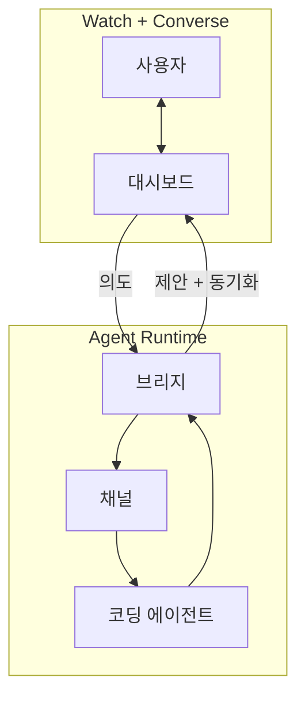
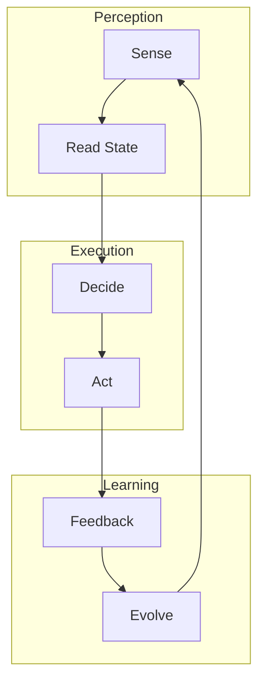

# ANA Concept

> **ANA(아나)** 는 **Agent-Native Lifestyle(ANL, 아넬)** 을 위한 **agent-native agent**다. 사용자는 대시보드를 보며 말하고, 에이전트는 맥락을 읽고 판단하고 실행하며, 필요하면 앱 자체를 고친다.

## 1. 핵심 문제

앱은 많지만 대부분은 사용자가 앱의 구조에 맞춰 움직이게 만든다. 일정, 메일, 결재, 고객, 주문, 학습, 건강처럼 매일 반복되는 운영은 각자 방식이 있는데, 기존 도구는 그 방식을 충분히 따라오지 못한다.

챗봇은 자연어 인터페이스를 제공하지만 시각적 맥락이 약하다. 코딩 에이전트는 앱을 만들 수 있지만 보통 개발 시간에 머문다. ANA는 이 둘을 합쳐, **운영 화면을 보면서 대화하고, 대화가 곧 앱의 진화로 이어지는 구조**를 만든다.

## 2. 용어 정의

| 용어 | 정의 |
|---|---|
| **ANA** | Agent Native Agent. Agent-Native Lifestyle을 실현하기 위해 만들어지는 자율형 에이전트 |
| **ANL** | Agent-Native Lifestyle. 일하고, 배우고, 만들고, 소비하고, 생활 루틴을 운영하는 방식이 에이전트 중심으로 재구성된 상태 |
| **agent-native** | 에이전트가 부가 기능이 아니라 런타임의 일부로 전제되는 설계 방식 |
| **watch** | 사용자가 핵심 상태를 대시보드에서 한눈에 보는 행위 |
| **converse** | 사용자가 자연어로 의도, 판단 기준, 변경 요청을 전달하는 행위 |
| **evolve** | 에이전트가 데이터뿐 아니라 앱의 UI, 규칙, 코드까지 개선하는 행위 |

## 3. Assistant가 아니라 Agent인 이유

Assistant는 보조자에 가깝다. 사용자가 시키는 일을 돕는 느낌이 강하다. ANA에서 필요한 존재는 더 적극적이다.

- 맥락을 감지한다.
- 해야 할 일을 판단한다.
- 변경안을 제안한다.
- 승인된 일을 실행한다.
- 반복 패턴을 학습해 앱을 개선한다.

따라서 ANA의 중심 단어는 Assistant가 아니라 **Agent**다. ANA는 답변 UI가 아니라, 사용자의 생활과 업무 운영에 참여하는 실행 주체다.

## 4. 작동 구조

Mermaid는 README에서도 잘 보이도록 가로로 길게 늘리지 않고, 두 개의 균형 잡힌 블록으로 배치한다.

역할은 분리된다.

- 대시보드는 핵심 상태와 대화 입력을 한 화면에 둔다.
- 브리지는 상태, 요청 큐, 승인 카드, 동기화를 담당한다.
- 채널은 사용자 의도를 에이전트 세션에 확실히 밀어 넣는다.
- 코딩 에이전트는 상태를 읽고, 판단하고, 실행하고, 앱을 고친다.

## 5. Agentic Loop

ANA의 에이전트성은 한 번의 응답이 아니라 반복 루프에서 나온다.

이 루프가 있어야 ANA다. 단순 챗봇처럼 텍스트만 답하면 부족하다. 단순 대시보드처럼 상태만 보여줘도 부족하다. 에이전트가 상태를 읽고, 판단하고, 실행하고, 반복 개선하는 경로가 있어야 한다.

## 6. 설계 원칙

### 6.1 Watch + Converse

사용자는 화면을 보면서 말해야 한다. 대시보드 없이 채팅만 있으면 매번 맥락을 다시 설명해야 한다. 채팅 없이 대시보드만 있으면 앱이 고정된 기능에 갇힌다.

### 6.2 Proposal Before Mutation

변경은 바로 적용하지 않는다. 에이전트는 전후 비교, 영향 범위, 승인/거절 액션을 제안 카드로 보여준다. 사용자가 승인하면 서버 상태와 앱 코드가 바뀐다.

### 6.3 Versioned Shared State

상태에는 `version`이 있어야 한다. 변경마다 버전을 올리고, 모든 접속자는 폴링 또는 이벤트로 동기화한다. `localStorage` 중심 설계는 ANA에 맞지 않는다. 여러 기기에서 같은 운영 상태를 봐야 한다.

### 6.4 Runtime Evolution

ANA의 강점은 “사용 중 진화”다. 사용자가 같은 요청을 반복하면 그 요청은 기능이 되어야 한다. 예를 들어 “매번 아침 회의 전 요약해줘”라는 요청이 반복되면, 대시보드에 아침 브리프 패널이 생겨야 한다.

## 7. ANA가 아닌 것

| 형태 | 왜 부족한가 |
|---|---|
| 챗봇 위젯 | 화면 맥락과 상태 동기화가 약하다 |
| 일반 대시보드 | 자연어 운영과 런타임 진화가 없다 |
| 노코드 템플릿 | 박스 안의 변경만 가능하고 에이전트 실행 루프가 약하다 |
| 코딩 에이전트 단독 사용 | 앱을 만든 뒤 운영 화면과 연결되지 않는다 |

## 8. ANL 예시를 읽는 방법

ANL은 별도 리포지토리가 아니라, ANA가 만들어내는 결과를 설명하는 관점이다. `examples/`의 각 사례는 다음 질문에 답해야 한다.

- 사용자의 반복 루틴은 무엇이었나?
- ANA가 한 화면에서 보여주는 핵심 상태는 무엇인가?
- 사용자가 자연어로 위임하는 판단은 무엇인가?
- 에이전트가 실행할 수 있는 액션은 무엇인가?
- 반복 사용 후 앱은 어떻게 바뀌었나?
- 이 변화가 어떤 lifestyle shift를 만들었나?

## 9. 최소 검수 기준

- 핵심 상태가 한 화면에 보인다.
- 같은 화면에서 자연어로 운영한다.
- 에이전트가 상태를 읽고 액션을 수행한다.
- 변경은 전후 미리보기와 승인 카드로 제시된다.
- 상태는 서버에 저장되고 버전으로 동기화된다.
- 반복 요청은 앱 기능 또는 규칙으로 흡수된다.
- 사용자는 하네스를 소유하고 다른 도메인으로 복제할 수 있다.

## 10. 한 줄 요약

**ANA는 Agent-Native Lifestyle을 위한 agent-native agent다.**  
사용자는 보고 말하고, 에이전트는 판단하고 실행하고, 앱은 사용 중에 자란다.
